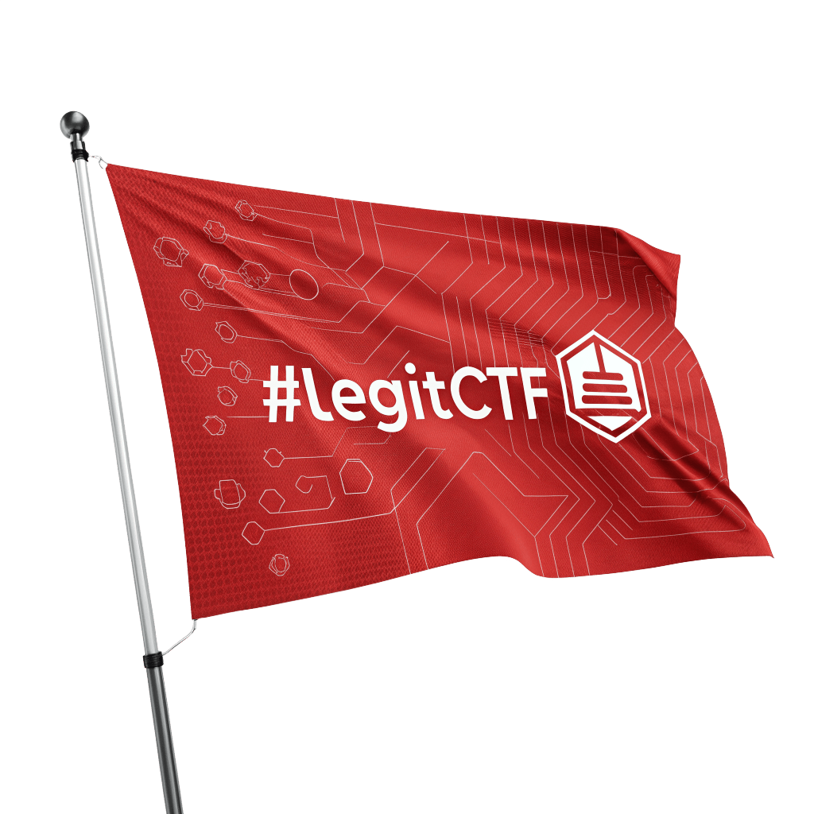

# LegitCTF
Reinforces fair play. 



A simple project to create your own ctf locally. Working on docker it is easy to deploy and custom.
The main idea behind this project is to stop to use common ctf flag, because it is easy for player to share it with their firends.
To avoid this, a password is provided for each participant. When a participant compromises a machine, he can execute the flag.sh script on the target to validate the machine's. 
He will then be asked for his password to authenticate it. The database is then updated, as are the graphs on the front end.


## Table of Contents

- [Installation](#installation)
- [Usage](#usage)
- [Contributing](#contributing)
- [License](#license)

## Installation
### Prerequisite
. docker with compose plugin
. ansible
. sshpass

You must also installed yq. On Ubuntu :

```bash
snap install yq --channel=v4/stable
```

On your hypervisor, a host only network configured (with dhcp, i think it is configured by default on VirtualBox).
This network will be use as secured network to communicate with the ctf API.


### CTF server side
As it works on docker you should install docker on your machine. You should install Ansible to manage your ctf machines.

```bash
chmod +x install.sh
./install.sh
#Follow instruction
```

### Vulnerable machine
1. Add the content of vm_client directory on your machines.
2. On your vm add in your /etc/hosts the CN set in the openssl 
for example 127.0.0.1 ctf
3. Use ansible playbook or set manually variable in flag.conf
4. Authenticate your vm to your CTF server via the command
chmod +x flag.sh
./flag.sh -f

### How to add new machines
Machine are considered as challenge. A VM isn't a machine but an instance of a machine.
Before to add new instance inside a ctf you should define a machine. You can link multiple instance to a machine.
To create a new machine you can use the sctipt bin/createMachine.sh.


### How to create new instance
An instance is a VM, but a VM can be multiple instance of different machine/challenge to able to have differeznt level opf flag. For the moment, only root flag works.
First of all you should initialize instance inside ansible using the installation script or createInstance.sh. It is really simple :)

When you have a vm to pwn, and you want to add it inside the environment, you have to configure it to do it. 
To do it you should have at least to network interfaces for this vm. One bridge for example, used to be accessible by participant, and another one (host only reccomended)
to communicate with the ctf server. 
The Ansible script will configure everything for you, but there are a few things you need to know to make it work.
1. The ip from an another interface (bridge one for example)
2. A username + password with root privilege on the system
3. The name of the instance you want to configure
4. A SSH server installed and running

Then run the following command:
ansible-playbook -l <instance_name> -e 'ansible_user=<vm_user>' --ask-pass  playbooks/init.yml -i ./inventory/<host_file> -e 'ansible_host=<VM_IP>'  

If you have issue with the privesc add --ask-become-pass

The <instance_name> shall be found in ansible/inventory/<host_file>. It is the name of the instance you want to configure.


### How to enroll new instane
You have to enroll your machine to register them as accessible instance of a machine.
The enroll process include a cleaning process to avoid to have unwanted log or history on the system.


## This is your first time

No problem there is a script to assist you :)
Execute this command
``` bash
bin/firstInit.sh
```
It will call for you all the other scripts to create CTF, Machine, Instance, Admin ....

## Administrate your ctf

### Create another ctf

You have to execute :

```bash
bin/createCtf.sh
```

It will assist you to create the ansible configuration and edit the database for you.

### Add other machine / challenge

```bash
bin/createMachine.sh
```


### Add another instance

```bash
bin/createInstance.sh
```


### enroll a VM to an instance

You need to have a user with root privilege on the VM and know is password.
You need to set 2 netwi

 ansible-playbook  -u "prof" -e 'ansible_user=prof' --ask-pass  playbooks/init.yml -i ./inventory/5A2025_hosts.yml --ask-become-pass -e 'ansible_host=192.168.1.172' -l "Fast_10"

### Add users for ctf

You have to start the docker if it's not already done.
```bash
docker compose up
```


Then, connect from the CTF host (where the docker run) to the web interface, by default https://127.0.0.1:8080 (i know it's not a common https port i will correct it later).
On the top left, there is an admin button.
Log in with the admin credntials you have set when you run firstInit. You can also create a new admin with bin/createAdmin.sh.
In the Administration interface, you can easily add user and reset their passwords.

IMPORTANT: to connnect as an admin you have to be locally connected or it will not work.


### Start an instance 
```bash
ansible-playbook playbooks/start.yml -i ./inventory/<host_file> -l <instance_name>
```

## Contributing

Guidelines for contributing to the project.


## To do List

- Monitoring of flag validation to detect potential cheating.
- Easy backup generator

## License

Information about the project's license.

## List of js package 
npm install moment chart.js chartjs-adapter-moment

